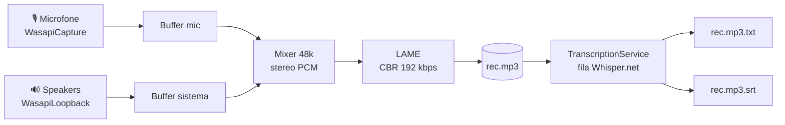

<div align="center">

# 🎙️ Transcribid

**Grave mic + áudio do sistema num único MP3 e transcreva 100% localmente com Whisper.**  
**Record mic + system audio into one MP3 and transcribe 100% locally with Whisper.**

<br/>

[](https://dotnet.microsoft.com/download/dotnet/8.0)
[](https://learn.microsoft.com/en-us/dotnet/desktop/wpf/)
[](https://github.com/caioross/Transcribid/releases/latest)
[](https://github.com/sandrohanea/whisper.net)
[](https://github.com/naudio/NAudio)
[](LICENSE)
[](https://github.com/caioross/Transcribid)
[](https://github.com/caioross/Transcribid/releases/latest)

<br/>

> _Sem nuvem. Sem API key. Sem custo por minuto. Tudo na sua máquina._  
> _No cloud. No API key. No per-minute cost. Everything stays on your machine._

<br/>

[📥 Baixar / Download](https://github.com/caioross/Transcribid/releases/latest) · [🌐 Site](https://transcribid.vercel.app) · [📖 Docs](#como-funciona--how-it-works)

</div>

---

🇧🇷 [**Português**](#-português) · 🇺🇸 [**English**](#-english)

---

## 🇧🇷 Português

### O problema

Você está numa reunião do Meet/Zoom, numa call do Discord, ou assistindo a uma aula — e quer um **registro fiel em texto** depois. As soluções existentes ou:

- ☁️ **Mandam seu áudio pra nuvem** (privacidade + custo por minuto)
- 🎤 **Só gravam o microfone** — perde o outro lado da conversa
- 🛠️ **São só linha de comando** — sem interface gráfica, sem lista de gravações

**Transcribid** resolve as três: captura **sua voz (mic) e tudo que você ouve (áudio do sistema)** simultaneamente num único MP3, e transcreve **localmente com Whisper** — sem internet, sem chave de API, sem mandar nada pra lugar nenhum.

---

### Comparação com alternativas

| Recurso | **Transcribid** | Otter.ai | Whisper CLI | Teams/Zoom |
|---|:---:|:---:|:---:|:---:|
| Captura áudio do sistema | ✅ | ❌ | ❌ | ⚠️ só no app |
| Transcrição local (offline) | ✅ | ❌ | ✅ | ❌ |
| Sem API key / conta | ✅ | ❌ | ✅ | ❌ |
| Gratuito sem limites | ✅ | ⚠️ limitado | ✅ | ⚠️ requer licença |
| Interface gráfica (GUI) | ✅ | ✅ | ❌ | ✅ |
| Exporta `.srt` com timestamps | ✅ | ✅ | ✅ | ⚠️ |
| Single-file, sem instalar runtime | ✅ | N/A | ❌ | N/A |
| Funciona offline | ✅ | ❌ | ✅ | ❌ |

---

### Recursos

| | Recurso | Detalhe |
|---|---|---|
| 🎚️ | **Captura dupla simultânea** | Mic (WasapiCapture) + loopback WASAPI, mixados num MP3 CBR 192 kbps stereo 48 kHz |
| 🧠 | **Transcrição 100% local** | Whisper.net multilíngue rodando na sua CPU — nada sai da máquina |
| 💬 | **Exporta `.txt` + `.srt`** | Texto limpo e legenda com timestamps por segmento, ao lado do MP3 |
| ⚡ | **Auto-transcrição** | Transcreve sozinho assim que você para a gravação (opcional) |
| 💾 | **Streaming pra disco** | Grava em tempo real direto no arquivo — aguenta reuniões de horas sem encher a RAM |
| 🛡️ | **Watchdog + recovery** | Se mic ou sistema parar de entregar áudio, segue gravando com o outro sem travar |
| 🔇 | **Silence keep-alive** | Mantém o loopback ativo mesmo em silêncio total — nada se perde nas pausas |
| 📥 | **Modelo sob demanda** | Baixa o GGML (`small` ~466 MB) de Hugging Face na primeira transcrição, com retomada via `.part` |
| 📊 | **VU meters separados** | Visualize em tempo real se mic e sistema estão entrando corretamente |
| 🎨 | **Single-file self-contained** | Um único `.exe` que roda em qualquer Windows 10/11 x64 — sem instalar `.NET` |

---

### Download e instalação

**→ [Baixar última versão (.exe)](https://github.com/caioross/Transcribid/releases/latest)**

Baixe, dê dois cliques. Pronto. Não precisa instalar nada.

> O build é **single-file self-contained**: o `.NET 8 runtime` está embutido no executável.

Na primeira transcrição, o app baixa automaticamente o modelo Whisper GGML `small` (~466 MB) de Hugging Face. O download retoma de onde parou caso seja interrompido.

#### Compilar do código-fonte

Pré-requisito: **.NET 8 SDK** — <https://dotnet.microsoft.com/download/dotnet/8.0>

```bat
:: Build single-file self-contained → AudioRecorder\bin\publish\Transcribid.exe
cd AudioRecorder
build.bat

:: Modo desenvolvimento (sem publish, mais rápido)
run-dev.bat
```

---

### Onde ficam os arquivos

| O quê | Caminho |
|---|---|
| Gravações | `%USERPROFILE%\Documents\Transcribid\rec-AAAA-MM-DD_HH-mm-ss.mp3` |
| Transcrição · legenda | `rec-….mp3.txt` e `rec-….mp3.srt` (ao lado do MP3) |
| Configurações | `%APPDATA%\Transcribid\settings.json` |
| Modelos Whisper | `%LOCALAPPDATA%\Transcribid\models\` |

> **Migração automática:** se você usou uma versão antiga em `Documents\Recorder\`, os arquivos são migrados na primeira execução.

Modelos suportados: `Tiny` · `Base` · `Small` · `Medium` · `LargeV3` — configure via ⚙ na barra superior.

---

### Como funciona



A thread de escrita só consome do mixer o que está bufferizado em **ambos** os streams — o MP3 acompanha o tempo real. CBR garante que a duração é exatamente `bytes × 8 / 192000`, sem precisar varrer headers VBR. A transcrição roda numa **fila com 1 job por vez** (Whisper já é multi-thread internamente).

---

### Estrutura do projeto

```
Transcribid/
├── AudioRecorder/                 ← App .NET 8 / WPF
│   ├── AudioRecorder.csproj       NAudio + NAudio.Lame + Whisper.net
│   ├── RecorderEngine.cs          Captura WASAPI + mix + MP3 (watchdog + recovery)
│   ├── RecordingsStore.cs         Lista gravações + duração CBR exata
│   ├── TranscriptionService.cs    Fila + worker Whisper.net
│   ├── WhisperModelManager.cs     Download/cache de modelos GGML
│   ├── AppSettings.cs             Configurações persistidas em JSON
│   ├── MainWindow.xaml(.cs)       UI (timer, VU meters, lista, ações)
│   ├── App.xaml(.cs)              Tema escuro + handler global de exceção
│   ├── build.bat                  Publish single-file win-x64
│   └── run-dev.bat                Modo dev (dotnet run)
├── site/                          ← Landing page (Next.js 14 + Tailwind)
├── RELATORIO.md                   Auditoria técnica detalhada do código
└── README.md                      ← Este arquivo
```

---

### FAQ

<details>
<summary><strong>O app manda meu áudio pra internet?</strong></summary>

Não. O processamento é 100% local. O único tráfego de rede é o download do modelo Whisper (~466 MB, uma única vez). Depois disso, o app funciona completamente offline.
</details>

<details>
<summary><strong>Precisa de GPU?</strong></summary>

Não. A transcrição roda na CPU usando Whisper.net. Uma GPU aceleraria (via CUDA), mas não é obrigatória. Com o modelo `small`, espere ~1–3 minutos de processamento para cada 10 minutos de áudio em hardware médio.
</details>

<details>
<summary><strong>Por que o modelo é ~466 MB?</strong></summary>

O modelo `small` do Whisper tem boa precisão com custo de memória razoável (~1 GB RAM durante a transcrição). Se quiser menor: `tiny` (~75 MB) ou `base` (~140 MB). Se quiser mais preciso: `medium` (~1.5 GB) ou `large-v3` (~3 GB).
</details>

<details>
<summary><strong>Funciona com qualquer app de áudio?</strong></summary>

Sim, contanto que o áudio passe pelo dispositivo de saída do Windows. Funciona com Google Meet, Zoom, Teams, Discord, YouTube, Spotify, VLC — qualquer aplicativo.
</details>

<details>
<summary><strong>Por que o .exe é grande (~100 MB)?</strong></summary>

O build é self-contained: o runtime .NET 8 completo está embutido no executável. Isso garante que você não precisa instalar nada na máquina-alvo.
</details>

<details>
<summary><strong>O app suporta múltiplos microfones ou saídas?</strong></summary>

O `RecorderEngine` enumerga automaticamente todos os dispositivos de captura e de saída ativos e os mixa juntos. Se você tem dois microfones plugados, ambos são capturados.
</details>

---

### Contribuindo

Contribuições são bem-vindas! Siga o fluxo padrão:

1. Fork o repositório
2. Crie uma branch: `git checkout -b feature/minha-feature`
3. Faça suas mudanças e garanta que `dotnet build -c Release` passa sem erros
4. Abra um Pull Request descrevendo o que você mudou e por quê

Para bugs, abra uma [issue](https://github.com/caioross/Transcribid/issues) com o log de exceção e as informações do sistema.

---

### Licença

MIT © [Caio Ross](https://github.com/caioross) — veja [LICENSE](LICENSE) para detalhes.

---

## 🇺🇸 English

### The problem

You're in a Meet/Zoom meeting, a Discord call, or watching a lecture — and you want a **faithful text record** afterwards. Existing solutions either:

- ☁️ **Send your audio to the cloud** — privacy risk + per-minute cost
- 🎤 **Only record the microphone** — losing the other side of the conversation
- 🛠️ **Are CLI-only** — no GUI, no recording list, no one-click transcribe

**Transcribid** solves all three: it captures **your voice (mic) and everything you hear (system audio)** simultaneously into a single MP3, and transcribes it **locally with Whisper** — no internet, no API key, nothing leaves your machine.

---

### Comparison with alternatives

| Feature | **Transcribid** | Otter.ai | Whisper CLI | Teams/Zoom |
|---|:---:|:---:|:---:|:---:|
| Captures system audio | ✅ | ❌ | ❌ | ⚠️ in-app only |
| Local transcription (offline) | ✅ | ❌ | ✅ | ❌ |
| No API key / account needed | ✅ | ❌ | ✅ | ❌ |
| Free with no limits | ✅ | ⚠️ limited | ✅ | ⚠️ requires license |
| Graphical UI | ✅ | ✅ | ❌ | ✅ |
| Exports `.srt` with timestamps | ✅ | ✅ | ✅ | ⚠️ |
| Single-file, no runtime install | ✅ | N/A | ❌ | N/A |
| Works offline | ✅ | ❌ | ✅ | ❌ |

---

### Features

| | Feature | Detail |
|---|---|---|
| 🎚️ | **Simultaneous dual capture** | Mic (WasapiCapture) + WASAPI loopback, mixed into a CBR 192 kbps stereo 48 kHz MP3 |
| 🧠 | **100% local transcription** | Multilingual Whisper.net running on your CPU — nothing leaves the machine |
| 💬 | **Exports `.txt` + `.srt`** | Clean text and timestamped subtitles saved next to the MP3 |
| ⚡ | **Auto-transcription** | Optionally transcribes as soon as you stop recording |
| 💾 | **Streaming to disk** | Records directly to the file in real time — handles hours-long meetings without filling RAM |
| 🛡️ | **Watchdog + recovery** | If mic or system stops delivering audio, keeps recording with the other — no freeze |
| 🔇 | **Silence keep-alive** | Keeps the loopback active even in total silence — nothing is lost during pauses |
| 📥 | **On-demand model** | Downloads the GGML model (`small` ~466 MB) from Hugging Face on the first transcription, resumable via `.part` |
| 📊 | **Separate VU meters** | Real-time visual confirmation that both mic and system are being captured |
| 🎨 | **Single-file self-contained** | One `.exe` that runs on any Windows 10/11 x64 — no .NET install required |

---

### Download & Installation

**→ [Download latest release (.exe)](https://github.com/caioross/Transcribid/releases/latest)**

Download, double-click. Done. Nothing to install.

> The build is **single-file self-contained**: the .NET 8 runtime is embedded in the executable.

On the first transcription, the app automatically downloads the Whisper GGML `small` model (~466 MB) from Hugging Face. The download resumes from where it left off if interrupted.

#### Build from source

Prerequisite: **.NET 8 SDK** — <https://dotnet.microsoft.com/download/dotnet/8.0>

```bat
:: Self-contained single-file build → AudioRecorder\bin\publish\Transcribid.exe
cd AudioRecorder
build.bat

:: Dev mode (no publish, faster)
run-dev.bat
```

---

### Where files live

| What | Path |
|---|---|
| Recordings | `%USERPROFILE%\Documents\Transcribid\rec-YYYY-MM-DD_HH-mm-ss.mp3` |
| Transcript · subtitles | `rec-….mp3.txt` and `rec-….mp3.srt` (next to the MP3) |
| Settings | `%APPDATA%\Transcribid\settings.json` |
| Whisper models | `%LOCALAPPDATA%\Transcribid\models\` |

> **Auto-migration:** if you used an older version stored in `Documents\Recorder\`, files are migrated automatically on first run.

Supported models: `Tiny` · `Base` · `Small` · `Medium` · `LargeV3` — configure via ⚙ in the top bar.

---

### How it works

See the Mermaid diagram in the Portuguese section above.

The writer thread only consumes from the mixer what is buffered in **both** streams — so the MP3 tracks real time. CBR encoding makes the duration exactly `bytes × 8 / 192000` — no VBR header scanning needed. Transcription runs in a **single-job queue** (Whisper is already internally multi-threaded).

---

### Project layout

```
Transcribid/
├── AudioRecorder/                 ← .NET 8 / WPF app
│   ├── AudioRecorder.csproj       NAudio + NAudio.Lame + Whisper.net
│   ├── RecorderEngine.cs          WASAPI capture + mix + MP3 (watchdog + recovery)
│   ├── RecordingsStore.cs         Recording list + exact CBR duration
│   ├── TranscriptionService.cs    Queue + Whisper.net worker
│   ├── WhisperModelManager.cs     GGML model download/cache
│   ├── AppSettings.cs             JSON-persisted settings
│   ├── MainWindow.xaml(.cs)       UI (timer, VU meters, recording list, actions)
│   ├── App.xaml(.cs)              Dark theme + global exception handler
│   ├── build.bat                  Publish single-file win-x64
│   └── run-dev.bat                Dev mode (dotnet run)
├── site/                          ← Landing page (Next.js 14 + Tailwind)
├── RELATORIO.md                   Detailed technical audit of the codebase
└── README.md                      ← This file
```

---

### FAQ

<details>
<summary><strong>Does the app send my audio to the internet?</strong></summary>

No. All processing is 100% local. The only network activity is the one-time download of the Whisper model (~466 MB). After that, the app works completely offline.
</details>

<details>
<summary><strong>Do I need a GPU?</strong></summary>

No. Transcription runs on the CPU using Whisper.net. A GPU would speed things up (via CUDA), but it's not required. With the `small` model, expect roughly 1–3 minutes of processing for every 10 minutes of audio on average hardware.
</details>

<details>
<summary><strong>Why is the model ~466 MB?</strong></summary>

The Whisper `small` model offers good accuracy at a reasonable memory cost (~1 GB RAM during transcription). Want smaller: `tiny` (~75 MB) or `base` (~140 MB). Want more accurate: `medium` (~1.5 GB) or `large-v3` (~3 GB).
</details>

<details>
<summary><strong>Does it work with any audio app?</strong></summary>

Yes, as long as audio passes through the Windows output device. Works with Google Meet, Zoom, Teams, Discord, YouTube, Spotify, VLC — any application.
</details>

<details>
<summary><strong>Why is the .exe large (~100 MB)?</strong></summary>

The build is self-contained: the entire .NET 8 runtime is embedded in the executable, so you don't need to install anything on the target machine.
</details>

<details>
<summary><strong>Does the app support multiple microphones or outputs?</strong></summary>

`RecorderEngine` automatically enumerates all active capture and render devices and mixes them together. If you have two microphones plugged in, both are captured.
</details>

---

### Contributing

Contributions are welcome! Standard flow:

1. Fork the repository
2. Create a branch: `git checkout -b feature/my-feature`
3. Make your changes and ensure `dotnet build -c Release` passes with no errors
4. Open a Pull Request describing what you changed and why

For bugs, open an [issue](https://github.com/caioross/Transcribid/issues) with the exception log and system information.

---

### License

MIT © [Caio Ross](https://github.com/caioross) — see [LICENSE](LICENSE) for details.

---

<div align="center">

*Parte do ecossistema de projetos de [**Caio**](https://github.com/caioross).*  
*Part of [**Caio**](https://github.com/caioross)'s project ecosystem.*

</div>
