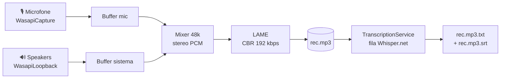

<div align="center">

# 🎙️ Transcribid

### Grava **mic + áudio do sistema** num só MP3 e transcreve **localmente** com Whisper
### Records **mic + system audio** into one MP3 and transcribes it **locally** with Whisper

_Sem nuvem. Sem API key. Sem custo por minuto. Tudo na sua máquina._<br/>
_No cloud. No API key. No per-minute cost. Everything stays on your machine._

<br/>


</div>

🇧🇷 [**Português**](#-português) · 🇺🇸 [**English**](#-english)

---

## 🇧🇷 Português
<a name="-português"></a>

### O problema

Você está numa reunião do Meet/Zoom, numa call do Discord, ou assistindo uma aula — e quer um **registro fiel** com o **texto** depois. As soluções existentes ou mandam seu áudio pra nuvem (privacidade + custo por minuto), ou só gravam o microfone (perde o outro lado da conversa), ou separam gravação de transcrição em dois apps diferentes.

**Transcribid** resolve as três coisas: captura **sua voz (mic) e tudo que você ouve (áudio do sistema)** simultaneamente num único MP3, e transcreve **localmente com Whisper** — sem internet, sem chave de API, sem mandar nada pra lugar nenhum.

### Recursos

- 🎚️ **Captura dupla simultânea** — microfone + loopback WASAPI do dispositivo de saída, mixados num MP3 CBR 192 kbps stereo 48 kHz.
- 🧠 **Transcrição local (Whisper.net)** — multilíngue, offline. Gera `.txt` e `.srt` (legendado com timestamps) ao lado do MP3.
- ⚡ **Auto-transcrição opcional** ao parar a gravação.
- 💾 **Streaming pra disco em tempo real** — aguenta reuniões de horas sem encher a RAM.
- 🛡️ **Watchdog + recovery** — se mic OU sistema parar de entregar áudio no meio, segue gravando só com o outro (sem travar).
- 🔇 **Silence keep-alive** — mantém o loopback vivo mesmo em silêncio total.
- 📊 **VU meters separados** pra mic e sistema.
- 📥 **Download de modelo sob demanda** — baixa o GGML (`small` ~466 MB) de Hugging Face na primeira transcrição, com retomada via `.part`.
- 🎨 **Tema escuro minimalista** e build single-file self-contained (não precisa instalar .NET na máquina-alvo).

### Como rodar

Pré-requisito: **.NET 8 SDK** — <https://dotnet.microsoft.com/download/dotnet/8.0>

```bat
:: Build single-file self-contained → bin\publish\Transcribid.exe
cd AudioRecorder
build.bat

:: Modo desenvolvimento (sem publish)
run-dev.bat
```

O `.exe` gerado roda em qualquer Windows 10/11 x64 sem dependências.

#### Onde ficam os arquivos

| O quê | Caminho |
|---|---|
| Gravações | `%USERPROFILE%\Documents\Transcribid\rec-AAAA-MM-DD_HH-mm-ss.mp3` |
| Texto / legenda | `rec-….mp3.txt` e `rec-….mp3.srt` (ao lado do MP3) |
| Configurações | `%APPDATA%\Transcribid\settings.json` |
| Modelos Whisper | `%LOCALAPPDATA%\Transcribid\models\` |

> Se você usou uma versão antiga em `Documents\Recorder\`, os arquivos são **migrados automaticamente** na primeira execução.

Modelos suportados: `Tiny`, `Base`, `Small`, `Medium`, `LargeV3`. Configuração via ⚙ na barra superior.

### Como funciona



A thread de escrita só consome do mixer o que está bufferizado em **ambos** os streams — assim o MP3 acompanha o tempo real. CBR garante que a duração é exatamente `bytes × 8 / 192000`, sem varrer headers VBR. A transcrição roda numa **fila com 1 job por vez** (Whisper já é multi-thread internamente).

### Estrutura

```
Transcribid/
└── AudioRecorder/                 ← projeto .NET (net8.0-windows, WPF)
    ├── AudioRecorder.csproj        NAudio + NAudio.Lame + Whisper.net
    ├── RecorderEngine.cs           captura + mix + MP3 (watchdog + recovery)
    ├── RecordingsStore.cs          lista gravações + duração CBR exata
    ├── TranscriptionService.cs     fila + worker Whisper.net
    ├── WhisperModelManager.cs      resolve / baixa modelo GGML on-demand
    ├── AppSettings.cs              settings persistido em JSON
    ├── MainWindow.xaml(.cs)        UI (timer, meters, lista, ações)
    ├── App.xaml(.cs)               tema escuro + handler global de exceção
    ├── build.bat / run-dev.bat     publish single-file / dev
    └── README.md                   doc técnica detalhada do AudioRecorder
```

> Há um `RELATORIO.md` na raiz: auditoria linha-a-linha do código (bugs, lacunas, plano de produto). É o diário de engenharia do projeto.

---

## 🇺🇸 English
<a name="-english"></a>

### The problem

You're in a Meet/Zoom meeting, a Discord call, or watching a lecture — and you want a **faithful recording** plus the **transcript** afterwards. Existing tools either ship your audio to the cloud (privacy + per-minute cost), capture only the microphone (losing the other side), or split recording and transcription across two separate apps.

**Transcribid** solves all three: it captures **your voice (mic) and everything you hear (system audio)** at once into a single MP3, and transcribes it **locally with Whisper** — no internet, no API key, nothing leaves your machine.

### Features

- 🎚️ **Simultaneous dual capture** — microphone + WASAPI loopback of the output device, mixed into one CBR 192 kbps stereo 48 kHz MP3.
- 🧠 **Local transcription (Whisper.net)** — multilingual, offline. Produces `.txt` and timestamped `.srt` next to the MP3.
- ⚡ **Optional auto-transcribe** when a recording stops.
- 💾 **Real-time streaming to disk** — survives hours-long meetings without filling RAM.
- 🛡️ **Watchdog + recovery** — if mic OR system stops delivering audio mid-recording, it keeps going with the other (no freeze).
- 🔇 **Silence keep-alive** keeps loopback running even in total silence.
- 📊 **Separate VU meters** for mic and system.
- 📥 **On-demand model download** — fetches the GGML model (`small` ~466 MB) from Hugging Face on the first transcription, resumable via `.part`.
- 🎨 **Minimalist dark theme** and a self-contained single-file build (no .NET install needed on the target machine).

### How to run

Prerequisite: **.NET 8 SDK** — <https://dotnet.microsoft.com/download/dotnet/8.0>

```bat
:: Self-contained single-file build → bin\publish\Transcribid.exe
cd AudioRecorder
build.bat

:: Dev mode (no publish)
run-dev.bat
```

The resulting `.exe` runs on any Windows 10/11 x64 with no dependencies.

#### Where files live

| What | Path |
|---|---|
| Recordings | `%USERPROFILE%\Documents\Transcribid\rec-YYYY-MM-DD_HH-mm-ss.mp3` |
| Text / subtitle | `rec-….mp3.txt` and `rec-….mp3.srt` (next to the MP3) |
| Settings | `%APPDATA%\Transcribid\settings.json` |
| Whisper models | `%LOCALAPPDATA%\Transcribid\models\` |

Supported models: `Tiny`, `Base`, `Small`, `Medium`, `LargeV3`. Configure via the ⚙ in the top bar.

### How it works

The writer thread only consumes from the mixer what is buffered in **both** streams, so the MP3 tracks real time. CBR encoding makes the duration exactly `bytes × 8 / 192000` — no VBR header scanning. Transcription runs on a **single-job queue** (Whisper is already internally multi-threaded). See the diagram in the Portuguese section above.

### Layout

A single .NET WPF project under `AudioRecorder/`: capture/mix/encode in `RecorderEngine.cs`, transcription queue in `TranscriptionService.cs`, model fetching in `WhisperModelManager.cs`. A detailed engineering audit lives in `RELATORIO.md`.

---

<div align="center">

*Parte do ecossistema de projetos de **Caio**.*

</div>
